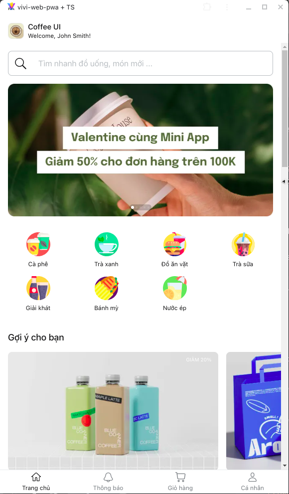
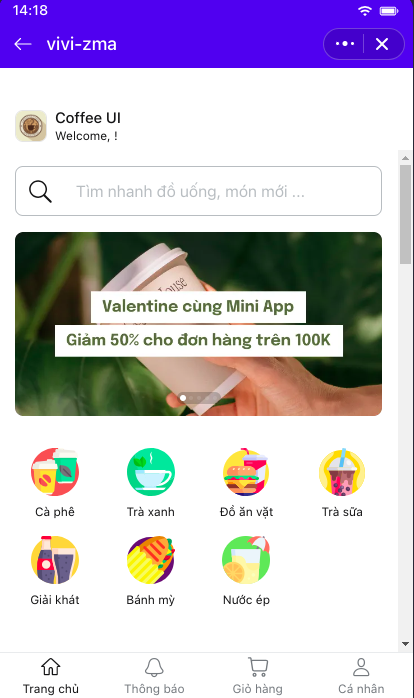

# Vivi App

[](https://nodejs.org/)
[](https://yarnpkg.com/)

A modern monorepo project containing both a Zalo Mini App and a Progressive Web Application.

## PWA:


## ZMA:



## 📋 Table of Contents

- [Overview](#overview)
- [Architecture](#architecture)
- [Prerequisites](#prerequisites)
- [Getting Started](#getting-started)
  - [Installation](#installation)
  - [Development](#development)
- [Project Structure](#project-structure)
- [Development Environments](#development-environments)
- [Deployment](#deployment)
- [Support](#support)

## 🎯 Overview

Vivi App is a comprehensive solution that includes both a Zalo Mini App and a Progressive Web Application. The project uses a monorepo structure to share common code and maintain consistency across platforms.

## 🏗 Architecture

The project consists of three main modules:

- **common**: Shared utilities, components, and SDKs
  - UI Components
  - State Management Stores
  - Common Functions
  - Shared SDKs

- **vivi-zma**: Zalo Mini App Module
  - Platform-specific implementations
  - ZMA-specific features
  - Custom UI components

- **vivi-web-pwa**: Progressive Web Application
  - Web-specific implementations
  - PWA features
  - Responsive design

## 🔧 Prerequisites

Before you begin, ensure you have met the following requirements:

- **Node.js**: `>= 20.x`
- **Yarn**: `>= 1.x`
- **VSCode** (Recommended IDE)
- **Zalo Mini App Extension** (For ZMA development)

## 🚀 Getting Started

### Installation

1. Install Yarn globally:
```bash
npm install -g yarn
```

2. Clone the repository:
```bash
git clone https://your-repository-url/vivi-app.git
cd vivi-app
```

3. Install dependencies:
```bash
yarn install
```

### Development

#### Vivi Web PWA

1. Open the workspace:
```bash
code vivi-web-pwa.code-workspace
```

2. Start development server:
```bash
yarn dev
```

3. For production builds:
```bash
yarn build
yarn preview        # Local preview
yarn preview --host # Network preview
```

#### Vivi ZMA

1. Open the workspace:
```bash
code vivi-zma.code-workspace
```

2. Using Zalo Mini App Extension:
   - Install the [Zalo Mini App Extension](https://mini.zalo.me/docs/dev-tools)
   - Configure your App ID
   - Navigate to Run panel > Start

3. Alternative using CLI:
```bash
yarn start          # Development server
zmp login           # Login to ZMP
zmp deploy          # Deploy to environment
```

## 📂 Project Structure

```
vivi-app/
├── common/                 # Shared modules
│   ├── components/         # Shared UI components
│   ├── contexts/           # React Context providers
│   ├── css/                # Global styles and theme
│   │   ├── base/           # Base styles
│   │   ├── components/     # Component-specific styles
│   │   ├── themes/         # Theme definitions
│   │   └── utils/          # CSS utilities
│   ├── hooks/              # Custom React hooks
│   ├── pages/              # Page components
│   ├── sdk/                # Software Development Kits
│   │   ├── web/            # Web-specific SDK
│   │   ├── zma/            # Zalo Mini App SDK
│   │   ├── base/           # Base SDK functionality
│   │   └── models/         # Shared data models
│   ├── utils/              # Utility functions
│   ├── app.tsx             # Root application component
│   ├── router.ts           # Application routing
│   └── state.ts            # Global state management
├── vivi-zma/           # Zalo Mini App
│   ├── src/
│   └── package.json
├── vivi-web-pwa/      # Web PWA
│   ├── src/
│   └── package.json
└── package.json       # Root package.json
```

## 📝 Development Guidelines

1. **Code Style**
   - Follow the project's ESLint configuration
   - Use TypeScript for type safety
   - Write meaningful commit messages

2. **Branch Strategy**
   - `main`: Production-ready code
   - `develop`: Development branch
   - `feature/*`: New features
   - `hotfix/*`: Emergency fixes

3. **Testing**
   - Write unit tests for new features
   - Ensure all tests pass before submitting PR
   - Follow test coverage guidelines

## 🌐 Development Environments

- **Development**: For active development
- **Staging**: For QA and testing
- **Production**: Live environment

## 📫 Support

For support and questions:
- Create an issue in the repository
- Contact the development team
- Check the documentation
